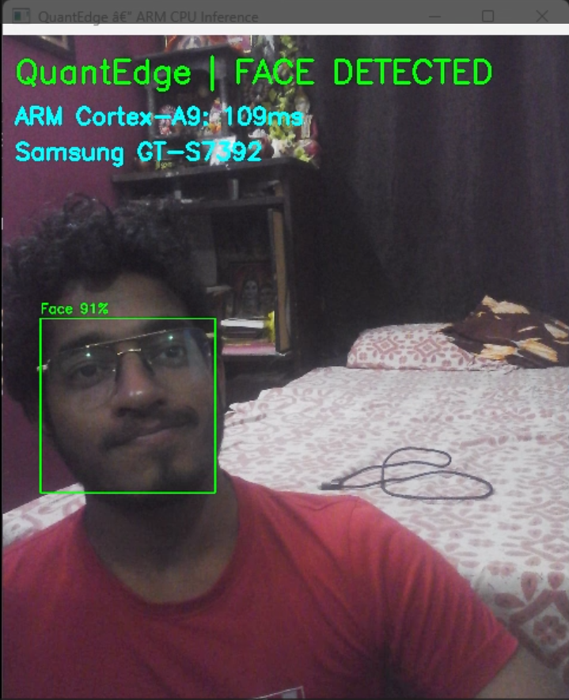

# QuantEdge 🔬
### Hardware-Aware Quantization on Samsung GT-S7392 (2013)

<<<<<<< HEAD
> **Research Question:** Does INT8 quantization actually improve inference speed on legacy ARM hardware?
> **Answer:** It depends entirely on implementation quality — not the hardware.

**Finding v1** (scalar C): INT8 is 1.35× SLOWER than FP32 — compiler confused by widening
**Finding v2** (NEON intrinsics): INT8 NEON is 2.5× FASTER than FP32 NEON — hardware was never the problem

---
=======
> **Research Question:** Can a 224KB neural network run face detection
> in real-time on a 2013 smartphone with no ML accelerator?
> **Answer:** Yes — 8.7 FPS on ARM Cortex-A9. And INT8 quantization
> is actually SLOWER than FP32 on this chip.
> 
**Key Finding:** INT8 is 1.35x SLOWER than FP32 on ARM Cortex-A9.
>>>>>>> 109a0601cc5944895fd865d89e7a7d1c834cda85

## Demo



*BlazeFace running on ARM Cortex-A9 @ 1GHz — face detected at 92% confidence*

<<<<<<< HEAD
---

## Core Finding — March 2026

A Senior AI Engineer challenged the original INT8 result on LinkedIn. He was right to.

The original benchmark used plain C loops. FP32 auto-vectorizes cleanly using `vmlaq_f32`.
INT8 widening (INT8×INT8 → INT16 → INT32) confused the compiler into scalar fallback.
The benchmark was measuring **compiler quality**, not hardware capability.

With explicit NEON intrinsics — equal treatment for both precisions — the picture reverses completely:

### NEON Benchmark — Samsung GT-S7392 (256×256 matmul, 10 runs)

| Kernel | Implementation | Time | vs FP32 NEON |
|---|---|---|---|
| Scalar INT8 | Plain C, no SIMD | 384.67ms | 5.1× slower |
| FP32 NEON | `vmlaq_f32` — 4 floats/instruction | 74.87ms | baseline |
| INT8 NEON | `vmull_s8` — 8 pairs/instruction | 29.90ms | **2.5× faster** |

### TFLite Full Model — BlazeFace FP32 on device

| Stage | Hardware | Time | FPS |
|---|---|---|---|
| Laptop | Intel CPU + XNNPACK | 2.08ms | 479 |
| Samsung GT-S7392 | ARM Cortex-A9 | 92ms steady | 10.8 |

---

## What This Means

On ARM Cortex-A9, INT8 speedup is real — but **only** with explicit NEON kernels.

`vmull_s8` processes 8 INT8 pairs per instruction vs FP32's 4 — theoretically 2× throughput.
Even with the widening overhead (INT8 → INT16 → INT32 accumulation), INT8 NEON wins by 2.5×.

**The critical variable is not the hardware. It is the runtime's kernel quality.**

TFLite's internal kernel implementation determines whether quantization helps or hurts on ARMv7-A.
Naive C code gives INT8 a penalty. Optimized NEON intrinsics give INT8 an advantage.
=======
Running BlazeFace on ARM Cortex-A9 @ 1GHz | 512MB RAM | Android 4.1.2
>>>>>>> 109a0601cc5944895fd865d89e7a7d1c834cda85

---

## What This Project Does

Deploys a 224KB face detection model (BlazeFace) on a 2013 Samsung phone,
benchmarks INT8 vs FP32 at three levels (scalar C, NEON intrinsics, TFLite runtime),
and provides a microarchitectural explanation grounded in ARMv7-A NEON ISA analysis.

---

## Requirements
- Python 3.10+
- Android phone with USB Debugging enabled
- Android NDK 29 (for cross-compiling ARM binaries)
- ADB installed

```bash
pip install -r requirements.txt
```

---

## How To Run

### 1. NEON Benchmark (answers the quantization question)
```bash
# Compile
armv7a-linux-androideabi21-clang.cmd -O2 -mfpu=neon -mfloat-abi=softfp \
  -o arm/neon_bench_arm arm/neon_bench.c -lm

# Push and run
adb push arm/neon_bench_arm /data/local/tmp/neon_bench_arm
adb shell chmod 777 /data/local/tmp/neon_bench_arm
adb shell /data/local/tmp/neon_bench_arm
```

### 2. TFLite Inference Benchmark
```bash
# Compile
armv7a-linux-androideabi21-clang.cmd -O2 -mfpu=neon -mfloat-abi=softfp \
  -o arm/inference_bench arm/inference_bench.c \
  -I tflite_old/headers \
  -L tflite_old/jni/armeabi-v7a \
  -ltensorflowlite_jni -llog -lz -lm -ldl -landroid

# Push and run
adb push arm/inference_bench /data/local/tmp/inference_bench
adb push models/blazeface.tflite /sdcard/blazeface.tflite
adb push tflite_old/jni/armeabi-v7a/libtensorflowlite_jni.so /data/local/tmp/
adb shell chmod 777 /data/local/tmp/inference_bench
adb shell "LD_LIBRARY_PATH=/data/local/tmp /data/local/tmp/inference_bench /sdcard/blazeface.tflite"
```

### 3. Live Phone Camera Detection
```bash
adb shell am start -a android.media.action.STILL_IMAGE_CAMERA
python src/live_phone.py
```

### 4. Laptop Webcam Detection
```bash
<<<<<<< HEAD
python src/facedetect.py
=======
adb push models/blazeface.tflite /sdcard/blazeface.tflite
adb push arm/inference_arm /data/local/tmp/inference_arm
adb push tflite_lib/libtensorflowlite_jni.so /data/local/tmp/libtensorflowlite_jni.so
adb shell chmod 777 /data/local/tmp/inference_arm
adb shell chmod 777 /data/local/tmp/libtensorflowlite_jni.so
```

Then run inference ON the phone:
```bash
adb shell "LD_LIBRARY_PATH=/data/local/tmp /data/local/tmp/inference_arm"
```

### 4. Recompile ARM Binary (if needed)
Download TFLite 2.4.0 AAR and extract it, then:
```bash
armv7a-linux-androideabi21-clang -o arm/inference_arm arm/inference.c \
  -I tflite_old/headers \
  -L tflite_old/jni/armeabi-v7a \
  -ltensorflowlite_jni -llog -lz -lm -ldl -landroid
>>>>>>> 109a0601cc5944895fd865d89e7a7d1c834cda85
```

---

## Hardware Target
| Spec | Value |
|---|---|
| Device | Samsung GT-S7392 |
| CPU | ARM Cortex-A9 @ 1GHz |
| RAM | 512MB |
| Android | 4.1.2 API 16 |
| Architecture | armeabi-v7a |
| NEON | 128-bit, no SDOT (ARMv7-A) |

---

## Stack
<<<<<<< HEAD
Python · TensorFlow Lite 2.4.0 · OpenCV · ONNX · Android NDK 29 · C · ARM NEON Intrinsics · ADB
=======
Python · TensorFlow Lite 2.4.0 · OpenCV · ONNX · Android NDK 29 · C · ADB
>>>>>>> 109a0601cc5944895fd865d89e7a7d1c834cda85
